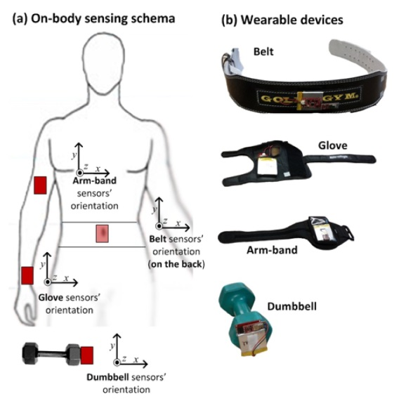

# Introduction
***
Wearable devices are popular for many people to quantify how much of a particular activity they do, but they rarely quantify how well they do it. 

"Weight Lifting Exercise Dataset" (Velloso et al., 2013) [^1] uses data from accelerometers on the belt, forearm, arm, and dumbell of 6 participants. Participants were asked to perform barbell lifts correctly and incorrectly in 5 different ways.

We will use different machine learning models, to predict with the measured data and classify different activities, as follows:  
* Class A: Exactly according to the specication  
* Class B: Throwing the elbows to the front  
* Class C: The dumbbell only halfway  
* Class D: Lowering the dumbbell only halfway  
* Class E: Throwing the hips to the front  



  

# Exploring Data
## Downloading Data

First we start by downloading the dataset, then reading both training and testing sets.
```{r download_data, cache=TRUE, eval=FALSE}
download.file(fileUrl_train, destfile = "pml_training.csv")
download.file(fileUrl_test, destfile = "pml_testing.csv")
fileUrl_train <- "https://d396qusza40orc.cloudfront.net/predmachlearn/pml-training.csv"
fileUrl_test <- "https://d396qusza40orc.cloudfront.net/predmachlearn/pml-testing.csv"

```

```{r read_data, eval=TRUE}
training_main <- read.csv("pml_training.csv")
testing_main <- read.csv("pml_testing.csv")
```


## Data Exploration 
```{r data_exploration, eval=FALSE}
dim(training_main); dim(testing_main)
str(training_main)
```

The training dataset has **`r dim(training_main)[1]`** rows X **`r dim(training_main)[2]`** columns.

The testing dataset has **`r dim(testing_main)[1]`** rows X **`r dim(testing_main)[2]`** columns.

### Plotting data

Exploring the dataset for 2 variables "Total Acceleration Forearm" Vs. "Total Acceleration Dumb bell" and differentiating by Classe Category.

There is no specific pattern in the data.

```{r plot, message=FALSE, warning=FALSE}
library(ggplot2)
qplot(total_accel_arm, total_accel_dumbbell, data = training_main, color=classe)

```


## Data Preprocessing

The dataset has many data that are either NA or empty, in-order to fit a good model, we will exclude those variables.

```{r pre_processing}
# Filter all columns that are not relevant. ie. has empty values or NA values
filter <- sapply(training_main, function(x) (sum(is.na(x)/dim(training_main)[1])>.9) | (sum(x == "")/dim(training_main)[1]>.9))

# Filter-out columns with missing data
training_main <- subset(training_main,select = !filter)
training_main <- subset(training_main, select = -c(1:7))
testing_main <- subset(testing_main,select = !filter)
testing_main <- subset(testing_main, select = -c(1:7))
```

The pre-processed training dataset has now **`r dim(training_main)[1]`** rows X **`r dim(training_main)[2]`** variables

The pre-processed testing dataset hasnow  **`r dim(testing_main)[1]`** rows X **`r dim(testing_main)[2]`** variables.

The variables that we will use in model fit are the following:
```{r variable_names,echo=FALSE}

data_codes <- matrix(c(names(training_main[1:9]), names(training_main[10:18]),names(training_main[19:27]), names(training_main[28:36]),names(training_main[37:45]),names(training_main[46:53]),""),nrow = 9, ncol = 6)

colnames(data_codes) <- c("Data", "Data", "Data","Data", "Data", "Data")

knitr::kable(data_codes)
```


## Data Partitioning
We create data partition for training and testing dataset. Whereby training will represent 70% of the dataset and 30% for the testing dataset.

```{r partition, message=FALSE, warning=FALSE}
library(caret); library(randomForest)
set.seed(112233)

inTrain <- createDataPartition(training_main$classe, p=0.7, list=FALSE)
training <- training_main[inTrain,]
testing <- training_main[-inTrain,]

```

## Repeated K-Fold Cross-Validation 
The dataset is quite large, and to train our model we will use K-Fold Cross-validation approach. With K-Folds of 10.

```{r cross_validation}
# Train control with repeated K-fold Cross Validation

train_control <- trainControl(method="repeatedcv", number=10, repeats=3)
```

## Models
Given the massive size of the dataset, the processing time for the different models is lengthy. In this report we consider the trade-off between processing time Vs. Accuracy.
Out of different models fits (**Q**uadratic **D**iscriminant **A**nalysis, **L**inear **D**iscriminant **A**nalysis, **G**eneralized **B**oosted **M**odels, **R**andom **F**orest), the QDA and Random Forest Models stood-out in processing time and accuracy.

```{r model_gbm_lda, eval=FALSE}
## Model fit gbm and lda
model_gbm <- train(classe~., data=training, trControl=train_control, method="gbm", verbose = FALSE)
model_lda <- train(classe~., data=training, trControl=train_control, method="lda")

## Total times used
model_gbm$times$final
model_lda$times$final

## Model Accuracy
gbm_accuracy <- confusionMatrix(training$classe, predict(model_gbm,training))$overall[1]
lda_accuracy <- confusionMatrix(training$classe, predict(model_lda,training))$overall[1]

```

|             |   Accuracy    | Processing Time   |
|------------:|--------------:|------------------:|
|GBM          |   97.2%       |   57 minutes      |
|LDA          |   70.4%       |   3.8 seconds     |

We reject both GBM and LDA due to their poor performance on the training dataset.

## Models used for prediction

The following 2 models are used for the final prediction:  
* QDA **Q**uadratic **D**iscriminant **A**nalysis  
* RF **R**andom **F**orest  

```{r model_qda_rf, cache=TRUE}
set.seed(11223344)

model_qda <- train(classe~., data=training, trControl=train_control, method="qda")

model_rf <- randomForest(classe~., data=training, importance=FALSE, ntree=512)
```

#### Model Accuracy and Confusion Matrix
```{r model_qda_rf_confusionmatrix}
## QDA Model
model_qda

conf_qda <- confusionMatrix(training$classe, predict(model_qda,training))
model_qda$times
conf_qda$overall[1]
conf_qda$table

## Random Forest Model
model_rf

```

#### Testing Dataset - Confusion Matrix for Random Forest

```{r Testing_confusionMatrix}
# Random Forest Model Confusion Matrix on testing dataset
confusionMatrix(testing$classe, predict(model_rf,testing))

```


### Conclusion
The prediction model used with best accuracy to classify the exercise is *Random Forest* with ntree of 512. The prediction model is quite accurate with **99.6%**.  

This is done on a repeated K-Fold Cross-Validation with K=10 and repeated 3 times.  


    
      
      

--------
### References
[^1]: Velloso, E.; Bulling, A.; Gellersen, H.; Ugulino, W.; Fuks, H. Qualitative Activity Recognition of Weight Lifting Exercises. Proceedings of 4th International Conference in Cooperation with SIGCHI (Augmented Human '13) . Stuttgart, Germany: ACM SIGCHI, 2013. 
